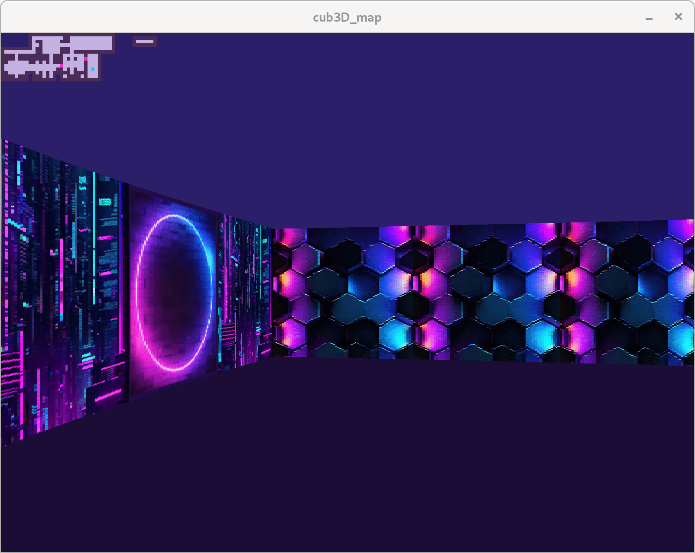
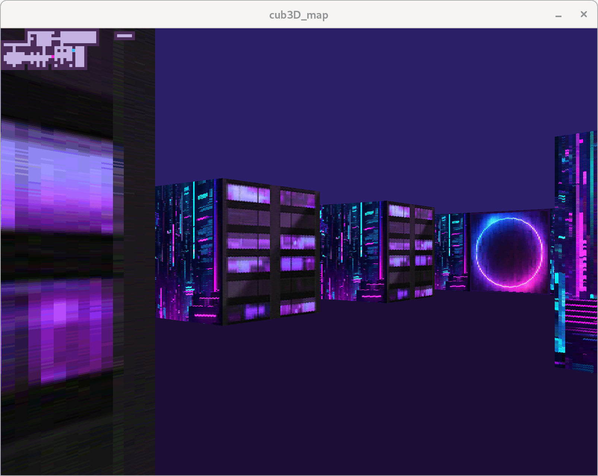
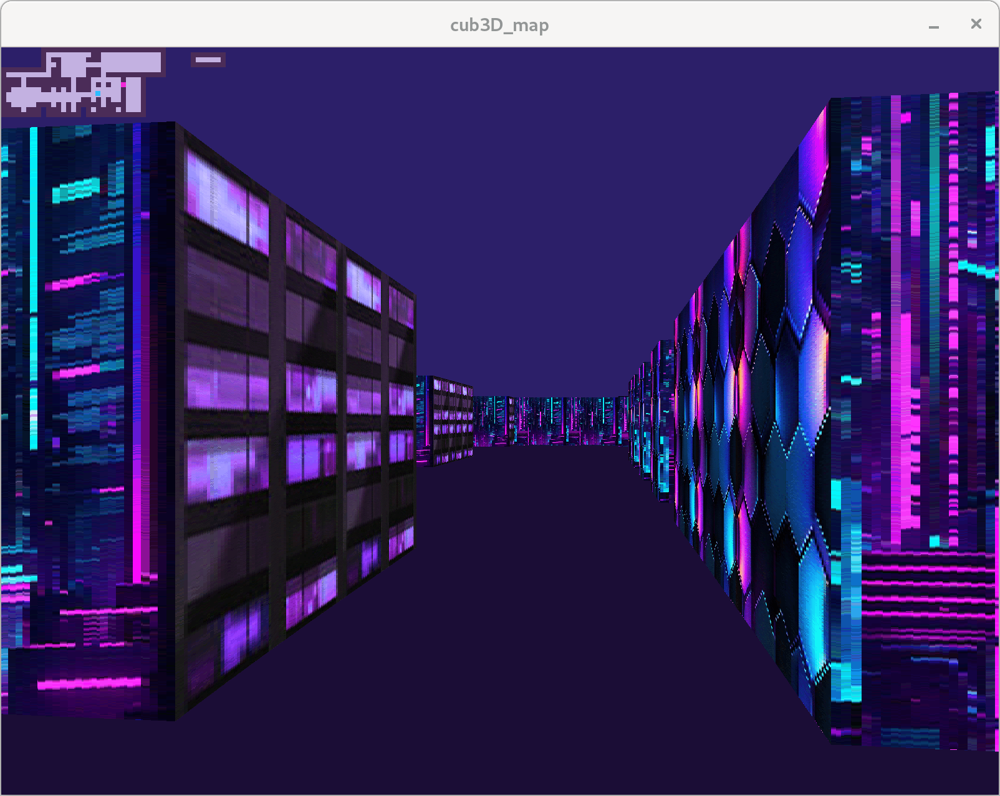
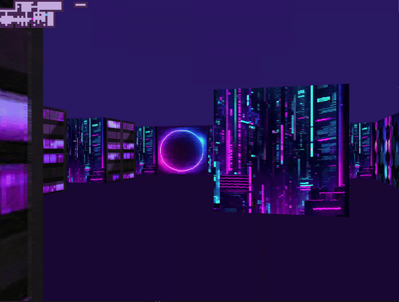
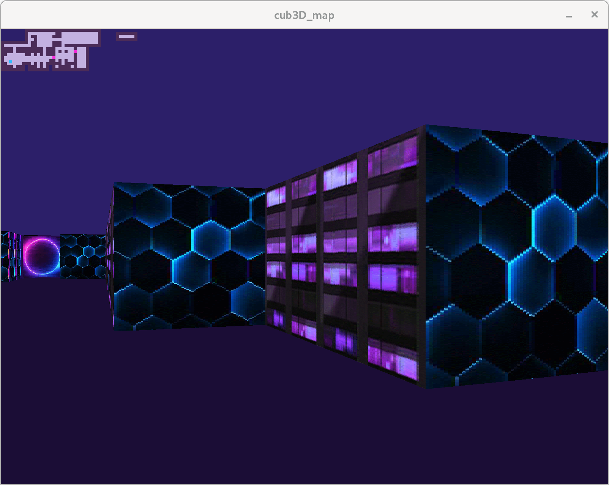
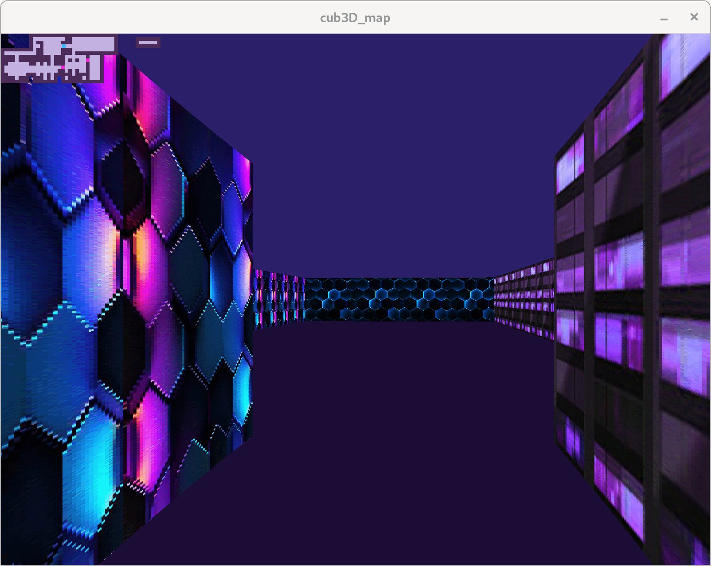
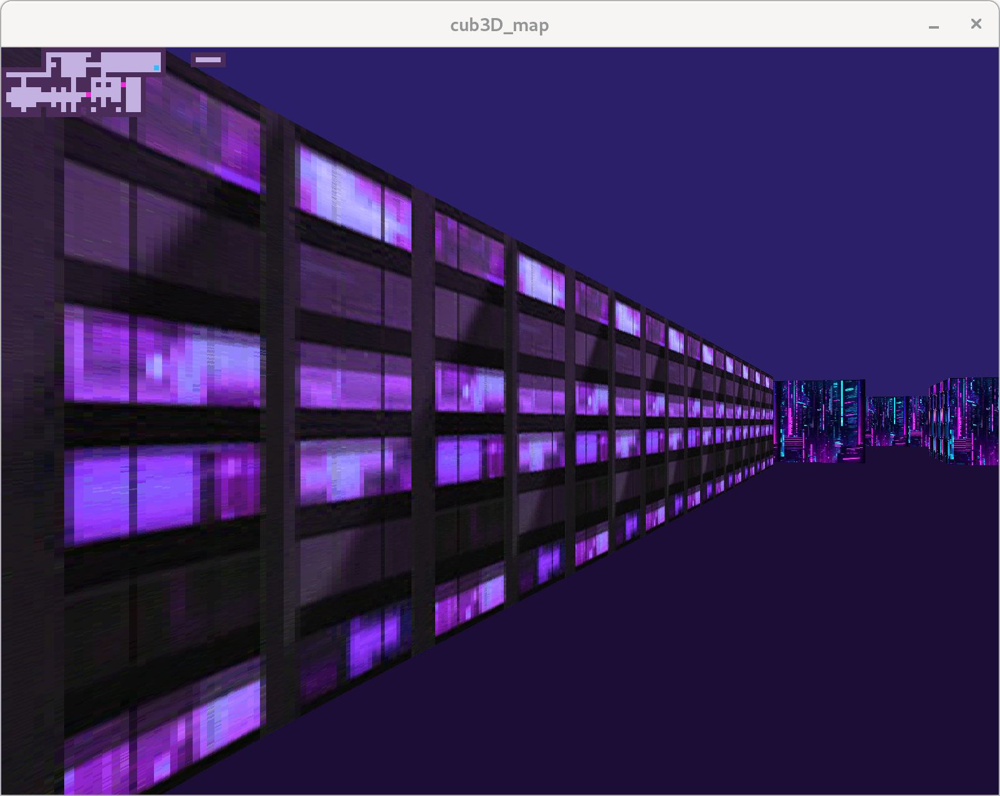

This game is a group project in 42 Comon Core. It's a 3D game programmed in C, with raycasting techniques for creating 3D environments. The game is inspired by classic games like Wolfenstein 3D and utilizes basic game physics for player interaction. We created our own walls textures following our moodboard inspired by Blade Runner and Cyberpunk graphic universe.

